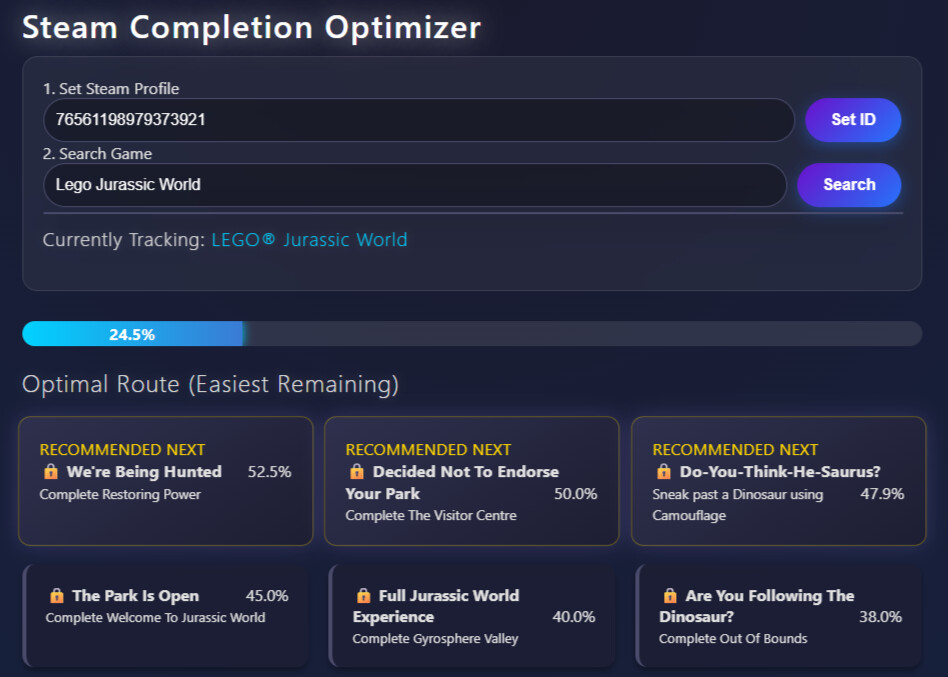

<div align="center">

# Steam Completionist Optimizer
### A Game Achievement Tracking Dashboard



<p></p>


A real-time, local web dashboard that tracks your Steam achievement progress. It analyzes global player statistics to suggest the **"Optimal Route"** (easiest achievements first) and provides visual "Toast" notifications when you unlock an achievement in-game. Removes **Guessworks** and ensuring **maximum progress** per sessions.

</div>

---

## Key Features

| Feature | Description |
| :--- | :--- |
| **Real-Time Polling** | Automatically polls the Steam API every 10 seconds to detect in-game unlocks without refreshing the page. |
| **Optimization Algorithm** | Sorts incomplete achievements by "Global Rarity," intelligently suggesting the most common (easiest) achievements to target next. |
| **Schema Translation** | Maps raw developer API codes (e.g., `E1INTRO`) to human-readable titles and descriptions using the Game Schema. |
| **Game Switcher** | Built-in search bar allows you to find and switch games instantly without needing to look up manual App IDs. |

---

## Repository Structure

```text
steam-completionist-optimizer/
│
├── Completionist.py      # Flask Backend (API, Data Fetching & Logic)
├── templates/
│   └── index.html        # Frontend HTML Structure
└── static/
    ├── style.css         # Styling (Lunar Color Palette and Animations)
    └── script.js         # Frontend Logic (Polling, Search, & UI Updates)
```

---

## Quick Start  
### 1. Clone the Repository  
```Bash
git clone [https://github.com/yourusername/steam-completionist-optimizer.git](https://github.com/yourusername/steam-completionist-optimizer.git)
cd steam-completionist-optimizer
```  

### 2. Install Dependencies  
```Bash
python -m venv venv
source venv/bin/activate  # On Windows use: venv\Scripts\activate

# Install required packages
pip install flask requests
```  
### 3. Configuration  
Open Completionist.py in your text editor and update the constants at the top:  

```Python
# Completionist.py

STEAM_API_KEY = 'YOUR_ACTUAL_STEAM_API_KEY'
DEFAULT_STEAM_ID = 'YOUR_ACTUAL_STEAM_ID'
```  
### 4. Run the Application  
```Bash
python Completionist.py
```  
The dashboard will start at http://127.0.0.1:5000  

---  

## Challenges Solved    
``Data Normalization & Schema Mapping``
> *Challenge:* Older games (like Grand Theft Auto IV) do not send readable titles via the standard GetPlayerAchievements endpoint. Instead, they return internal developer codes (e.g., E1INTRO, HALF_MILLION), making the dashboard unreadable.
>
> *Solution:* I implemented a secondary fetch sequence in Python. The backend first retrieves the user's progress, then queries the Steam Game Schema to create a translation map. This map dynamically replaces the raw codes with localized English titles and descriptions before sending the JSON payload to the frontend, ensuring a professional user experience for legacy titles. Now it went from internal developer codes to its real achievement title (e.g., from OPENEDALDERNEY to Full Exploration).

``API Unreliability & The 0.0% Bug``
> *Challenge:* Steam's official `GetGlobalAchievementPercentagesForApp` JSON API is notoriously unreliable for certain legacy games (like *Grand Theft Auto IV*), frequently returning empty datasets. This caused the application to default all achievement rarities to `0.0%`, completely breaking the "Optimal Route" sorting algorithm.
>
> *Solution:* I engineered a hybrid failover system using `BeautifulSoup4`. The backend attempts to fetch the official JSON first for speed and efficiency. If it detects an empty response, the system automatically pivots to an HTML scraper that targets the public Steam Community achievement pages. It parses the DOM elements (`.achieveRow`, `.achievePercent`) to extract the exact rarity numbers manually. This guarantees the sorting algorithm always has accurate data to guide the user, completely bypassing Steam's backend API outages.

